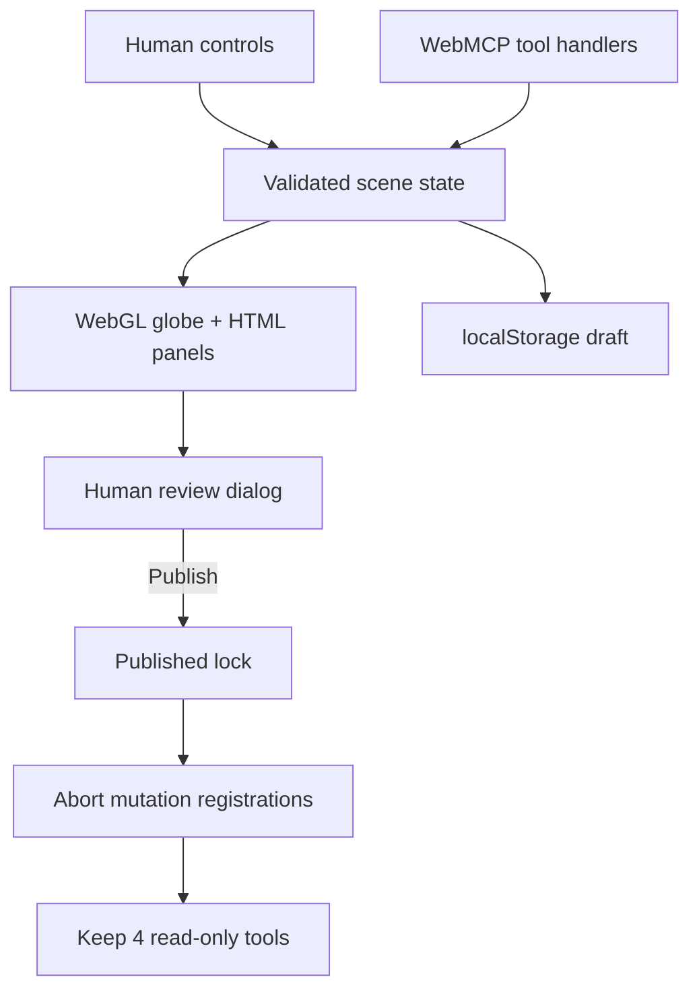

# TERRA architecture

TERRA is a dependency-free static web app built around one rule: the agent and the person must operate on the same visible scene. WebMCP handlers do not maintain a shadow model. They call the same state mutations and render path as manual controls.

## Runtime flow

## Shared state

`src/app.js` owns a normalized scene with the following inspectable fields:

- camera latitude, longitude, catalog place id, and zoom altitude;
- a 0–23 visualization hour;
- labels, lights, atmosphere, grid, and pin layer switches;
- visible pins, comparisons, distance measurements, and staged briefing text;
- a monotonically increasing revision, activity receipts, undo history, and publish lock.

Every tool mutation returns a receipt containing the new revision, publish state, visible camera/time/layers, collection counts, and the action result. The default `terra_read_scene` call is a compact verification summary. Pins, comparisons, measurements, and the staged brief are retrieved as pages of up to 8 records tied to that revision; long notes are previewed at 600 characters and `{ section, id }` returns one complete record. Stable ids and `nextOffset` allow complete traversal.

## Bounded Site-tool results

Native WebMCP execution returns each handler’s ordinary object directly. TERRA does not mirror the same payload into both `content.text` and `structuredContent`. Large untrusted fields remain complete but bounded per call: section pages carry only `revision`, `published`, paging metadata, and the records (the summary is not repeated), and `terra_export_markdown` returns at most 2,000 characters with a stable export id, total length, and continuation offset. Callers should restart pagination if the reported scene revision changes.

Each tool owns one job. `terra_find_places` is the only catalog lookup (empty query lists all 12 places), and `terra_compare_places` is the only geometry tool: with exactly two ids it also records the great-circle distance and bearing in the Measurements panel.

Undo is revision- and actor-aware. `terra_undo_last_change` requires the exact current revision and accepts only a latest reversible entry authored through a site tool. A newer visible user edit, publish/reopen action, stale revision, or reload boundary makes the tool refuse rather than overwrite user work.

## Globe renderer

`src/globe.js` creates a triangulated sphere and draws it with native WebGL. The camera rotates the sphere in latitude and longitude; zoom changes the orthographic scale. A local equirectangular SVG texture is mapped onto the mesh. The fragment shader computes the day/night terminator from visualization time and renders optional graticule and atmosphere effects.

Catalog markers use the matching orthographic projection in `src/engine.js`, including far-hemisphere clipping. Pointer drag, wheel zoom, keyboard camera controls, catalog buttons, and agent camera calls all update the same camera object. When WebGL is unavailable, a CSS sphere remains as a non-blocking fallback.

## WebMCP lifecycle

`src/webmcp.js` uses the current experimental imperative API:

1. Read `document.modelContext` (falling back to `navigator.modelContext`), and only in a top-level document.
2. Keep two `AbortController`s: one for the read-only group, one for the mutation group.
3. `await modelContext.registerTool(definition, { signal })` for each tool in a group; installs are serialized.
4. Forward the per-call `options.signal` to handlers.
5. On publish, abort only the mutation controller; on reopen, create a new one and register the mutation group again. The read-only group is re-registered only if its tool set changes.
6. Abort both groups and expose the local Tool Lab if native registration fails.

The draft state exposes 13 tools: four read-only tools and nine reversible mutation tools. Publishing aborts the mutation registration set and leaves the four read-only tools registered. Reopening is a manual UI action that re-registers the nine mutation tools. There is never a publish, commit, finalize, or dialog-confirmation tool.

## Trust boundaries

- All schemas use `additionalProperties: false`, bounded strings/arrays, enums, formats, and numeric ranges.
- Tool input is validated again inside the site even if the browser validates it.
- Current WebMCP `readOnlyHint` and `untrustedContentHint` annotations distinguish inspection tools and user-authored output.
- User-authored pin and briefing text carries `untrustedContentHint` and is inserted with `textContent` or escaped HTML.
- Persisted state is normalized before use; duplicate ids and invalid objects, revisions, measurements, or numeric ranges are dropped or clamped.
- The Content Security Policy disallows third-party scripts, objects, network APIs, and form exfiltration.
- `netlify.toml` and `public/_headers` configure `Origin-Agent-Cluster: ?1`, `Permissions-Policy: tools=(self)`, `frame-ancestors 'none'`, and `X-Frame-Options: DENY` for Netlify and compatible hosts. ChatGPT Sites does not currently support custom response headers, so on the production origin WebMCP relies on the top-level default `tools=self` and on the in-page frame guard that disables native registration inside any iframe.
- TERRA has no first-party backend, model key, telemetry, or analytics. Invoking a read/export site tool returns only the requested bounded scene page to the invoking agent.

## Performance and accessibility

The sphere mesh and texture are created once. WebGL rendering is capped at 2× device pixel ratio, pointer drags, pinches, wheel zoom, slider drags, and resizes only update state and coalesce into one `requestAnimationFrame` redraw, `localStorage` writes are debounced (~200 ms) and flushed on `pagehide`, markers are limited to a small local catalog, and scene collections have hard caps. The layout is responsive down to phone widths. The globe supports pointer, touch, wheel, and keyboard input; focus indicators, status live regions, reduced-motion preferences, a skip link, semantic controls, and a forced-colors fallback are included.
