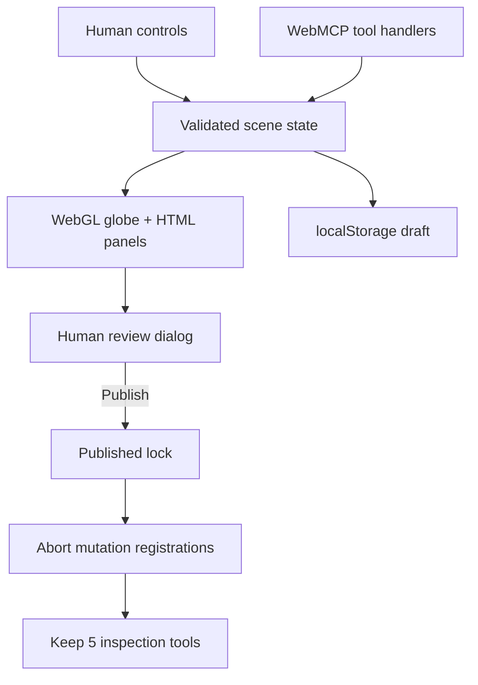

# TERRA architecture

TERRA is a dependency-free static web app built around one rule: the agent and the person must operate on the same visible scene. WebMCP handlers do not maintain a shadow model. They call the same state mutations and render path as manual controls.

## Runtime flow

## Shared state

`src/app.js` owns a normalized scene with the following inspectable fields:

- camera latitude, longitude, catalog place id, and zoom altitude;
- a 0–23 visualization hour;
- labels, lights, atmosphere, grid, and pin layer switches;
- visible pins, comparisons, distance measurements, and staged briefing text;
- a monotonically increasing revision, activity receipts, undo history, and publish lock.

Every tool mutation returns a receipt containing the new revision, publish state, visible camera/time/layers, collection counts, and the action result. The default `terra_read_scene` call is a compact verification summary. Pins, comparisons, measurements, and the staged brief are retrieved as one-record pages tied to that revision; stable ids and `nextOffset` allow complete traversal.

## Bounded Site-tool results

Native WebMCP execution returns each handler’s ordinary object directly. TERRA does not mirror the same payload into both `content.text` and `structuredContent`. Large untrusted fields remain complete but bounded per call: scene sections return one record at a time, and `terra_export_markdown` returns at most 2,000 characters with a stable export id, total length, and continuation offset. Callers should restart pagination if the reported scene revision changes.

Undo is revision- and actor-aware. `terra_undo_last_change` requires the exact current revision and accepts only a latest reversible entry authored through a site tool. A newer visible user edit, publish/reopen action, stale revision, or reload boundary makes the tool refuse rather than overwrite user work.

## Globe renderer

`src/globe.js` creates a triangulated sphere and draws it with native WebGL. The camera rotates the sphere in latitude and longitude; zoom changes the orthographic scale. A local equirectangular SVG texture is mapped onto the mesh. The fragment shader computes the day/night terminator from visualization time and renders optional graticule and atmosphere effects.

Catalog markers use the matching orthographic projection in `src/engine.js`, including far-hemisphere clipping. Pointer drag, wheel zoom, keyboard camera controls, catalog buttons, and agent camera calls all update the same camera object. When WebGL is unavailable, a CSS sphere remains as a non-blocking fallback.

## WebMCP lifecycle

`src/webmcp.js` uses the current experimental imperative API:

1. Read only `document.modelContext`.
2. Create one `AbortController` for a complete registration set.
3. `await document.modelContext.registerTool(definition, { signal })` for each tool.
4. Forward the per-call `options.signal` to handlers.
5. Abort the registration set before replacing it.
6. Abort partial registrations and expose the local Tool Lab if native registration fails.

The draft state exposes 15 tools: five inspection/navigation tools and ten reversible mutation tools. Publishing aborts that registration set and installs only the five non-publishing tools. Reopening is a manual UI action that restores all 15. There is never a publish, commit, finalize, or dialog-confirmation tool.

## Trust boundaries

- All schemas use `additionalProperties: false`, bounded strings/arrays, enums, formats, and numeric ranges.
- Tool input is validated again inside the site even if the browser validates it.
- Current WebMCP `readOnlyHint` and `untrustedContentHint` annotations distinguish inspection tools and user-authored output.
- User-authored pin and briefing text carries `untrustedContentHint` and is inserted with `textContent` or escaped HTML.
- Persisted state is normalized before use; duplicate ids and invalid objects, revisions, measurements, or numeric ranges are dropped or clamped.
- The Content Security Policy disallows third-party scripts, objects, network APIs, and form exfiltration.
- The production configuration explicitly sends `Origin-Agent-Cluster: ?1` and `Permissions-Policy: tools=(self)` rather than relying on browser defaults. Netlify and compatible hosts can use the checked-in configuration.
- TERRA has no first-party backend, model key, telemetry, or analytics. Invoking a read/export site tool returns only the requested bounded scene page to the invoking agent.

## Performance and accessibility

The sphere mesh and texture are created once. WebGL rendering is capped at 2× device pixel ratio, markers are limited to a small local catalog, and scene collections have hard caps. The layout is responsive down to phone widths. The globe supports pointer, touch, wheel, and keyboard input; focus indicators, status live regions, reduced-motion preferences, a skip link, semantic controls, and a forced-colors fallback are included.
